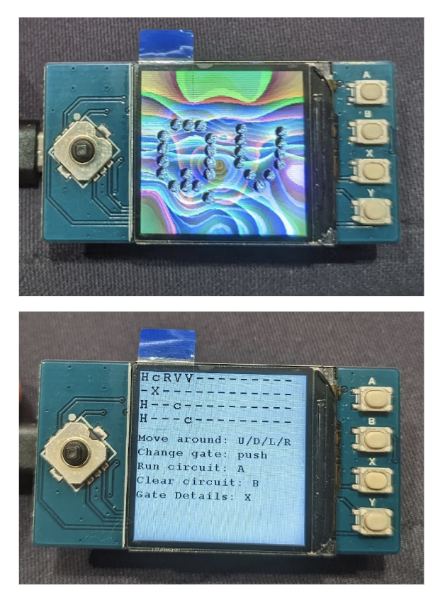

# uQ : micro Quantum
uQ - an embedded quantum simualtor

## Hardware Required

The uQ is currently designed for the following hardware (with links to PiHut):
* Raspberry Pi Pico - [https://thepihut.com/products/raspberry-pi-pico](https://thepihut.com/products/raspberry-pi-pico)
* LCD Display Module for Pico - [https://thepihut.com/products/1-3-ips-lcd-display-module-for-raspberry-pi-pico-240x240](https://thepihut.com/products/1-3-ips-lcd-display-module-for-raspberry-pi-pico-240x240)

These parts were chosen as they are very easy to assemble, and give us a nice basic interface; a screen, a small joystick, and some buttons. 

## Firmware Instructions

Download the [`pico-sdk`](https://github.com/raspberrypi/pico-sdk) and set the correct environment variables:

``` 
PICO_SDK_PATH=/path/to/pico-sdk
```

```
cd build/
cmake ..
```

and then run

`make -j9`

Then press `BOOTSEL` whilst plugging in the pico into a USB port, which will present as a USB drive. Now move the `main.u2f` to the drive, it will reboot and flash and you're good!

## What you should see

When you have built the module you should see something like this:



The usage is as follows:

* Use the dpad - up/down/left/right - to navigate the circuit.
* Press the joystick down to change the gates - currently supported gates include:
  * `-` - the identity gate ('do nothing')
  * `X` - the NOT gate
  * `H` - the Hadamard (superposition) gate
  * `R` - a fixed pi/8 `x`-axis rotation
  * `x` - the SWAP gate (MUST come in pairs)
  * `V` - the square root of the `X` gate
  * `c` - the control indicator - adds single qubit control to any given gate in that slice
* Press `A` to simulate and generate the output state vector
* Press `B` to clear the circuit
* Press `X` for the help screen
